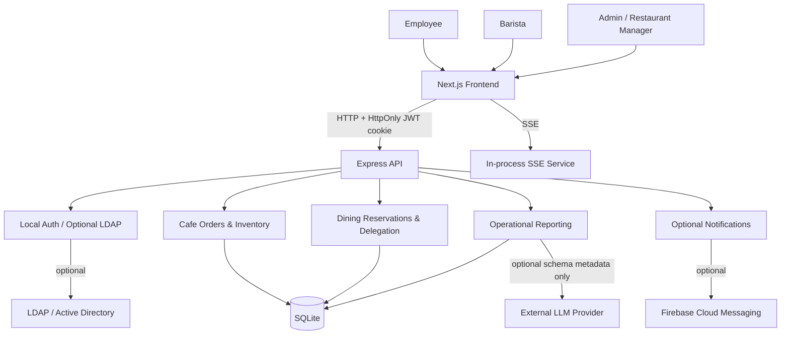

# Smart Food Operations

A full-stack internal cafe and employee dining operations platform with role-based access, transactional ordering, meal reservations, delegation, real-time updates, operational analytics, and optional LLM-assisted reporting.

This public repository is a generalized version of an internal food-service operations application. Organization-specific branding, credentials, infrastructure identifiers, and operational data have been removed and replaced with generic configuration and synthetic examples.

## Overview

Smart Food Operations combines two operational workflows in one application:

- **Cafe operations** — employee ordering, inventory-aware products, delivery locations, idempotent order submission, barista processing, and order history.
- **Employee dining** — company/location selection, weekly menus, meal entitlements, reservations, delegation, delivery workflows, and operational reports.

The core demo runs entirely locally with SQLite and synthetic accounts. LDAP/Active Directory, Firebase push notifications, and LLM-assisted analytics are optional integrations and are disabled by default.

## Screenshots

No screenshots from the original organizational deployment are included. Capture public screenshots from the synthetic demo only. See [`docs/screenshots/README.md`](docs/screenshots/README.md).

## Key Engineering Features

- Transactional cafe order creation with inventory updates
- Idempotent client request handling through `clientRequestId`
- Server-derived order ownership and pricing
- Role-based application access for employees, baristas, admins, and restaurant operators
- Restaurant permissions, weekly menus, entitlement limits, and reservation workflows
- Delegation with explicit priority ordering
- Signed, expiring restaurant delivery locks
- Server-Sent Events (SSE) for live order updates
- Optional Firebase Web Push integration
- Optional LDAP / Active Directory authentication integration
- Operational reporting and saved report definitions
- Optional **LLM-assisted natural-language-to-SQL analytics** with a read-only SQL policy

## Architecture



More detail: [`docs/architecture.md`](docs/architecture.md).

## Product Workflows

### Cafe

1. An authenticated employee browses enabled products.
2. The client submits product IDs, quantities, delivery location, and a client request ID.
3. The backend resolves the authenticated user from the session.
4. Product state and canonical prices are loaded from SQLite.
5. Availability, quantity limits, and optional credit are validated inside a transaction.
6. Inventory is decremented and the canonical order is persisted.
7. Repeated submissions with the same `clientRequestId` return the existing order.
8. Barista/admin users process the order and the employee receives live status updates through SSE.

### Employee dining

1. The employee selects a synthetic company/location.
2. The frontend loads the weekly menu, entitlement rules, and existing reservations.
3. Reservation quantities are validated against the employee's entitlement group.
4. A user with a valid delegation may reserve on behalf of another employee.
5. Delegation priority prevents lower-priority delegates from overriding higher-priority reservations.
6. Restaurant operators manage menus, reservations, delivery views, and reports.

## Roles & Permissions

Core application roles include:

- `user`
- `barista`
- `admin`
- `HR`

Restaurant access additionally uses permission-backed roles:

- Restaurant Admin
- Restaurant Manager
- Restaurant Staff
- Employee

Permissions include menu management, reporting, entitlement management, staff operations, employee reservations, and lunch verification.

## Real-Time Updates

Order status updates use Server-Sent Events. Connections are stored in process memory, which is appropriate for the local/reference deployment but is not horizontally scalable without a shared pub/sub layer.

## Analytics & LLM Reporting

Operational restaurant reporting is deterministic SQL/aggregation logic and does not require AI.

The optional reporting assistant can translate natural-language questions into SQLite queries and suggest chart configuration. It is deliberately described as **LLM-assisted natural-language-to-SQL analytics** rather than an autonomous agent.

Security boundaries:

- LLM use is disabled by default.
- Only database schema metadata is sent as context; real user/order rows are not included.
- Password and AD attribute columns are excluded from LLM schema context.
- Direct and LLM-generated SQL is validated as read-only.
- Mutations, schema changes, `ATTACH`, `DETACH`, `PRAGMA`, `VACUUM`, and transaction manipulation are rejected.

## Local Demo

### Demo accounts

All demo accounts use the local-only password:

`DemoPass!2026`

| Role | Employee number | Purpose |
|---|---:|---|
| Employee | `1001` | Cafe ordering and employee dining |
| Barista | `2001` | Cafe fulfillment workflow |
| Admin | `3001` | Administration and reporting |
| Restaurant Manager | `4001` | Restaurant management workflows |
| Delegate | `5001` | Delegation demonstration |

These credentials are synthetic and intended only for the local demo.

Synthetic locations include **North Campus**, **Central Office**, and **Innovation Hub**.

## Quick Start

Prerequisites: Node.js 22+ and npm.

```bash
# 1. Install dependencies
npm run install:all

# 2. Configure backend
cp Backend/.env.example Backend/.env

# 3. Configure frontend
cp Frontend/cafe-pwa/.env.example Frontend/cafe-pwa/.env.local

# 4. Reset and seed the synthetic SQLite database
npm run seed

# 5. Start the backend
npm run dev:backend

# 6. In another terminal, start the frontend
npm run dev:frontend
```

Open `http://localhost:3000` and sign in with one of the demo accounts above.

The example secrets are explicitly marked as local-demo placeholders. Production startup rejects placeholder secrets; generate strong secrets before any deployed use.

## Configuration

See:

- [`Backend/.env.example`](Backend/.env.example)
- [`Frontend/cafe-pwa/.env.example`](Frontend/cafe-pwa/.env.example)

Default public/demo settings:

```env
AUTH_MODE=local
NOTIFICATIONS_PROVIDER=none
LLM_ENABLED=false
NEXT_PUBLIC_NOTIFICATIONS_PROVIDER=none
```

## Optional Integrations

### LDAP / Active Directory

Set `AUTH_MODE=ldap` and configure:

- `LDAP_URL`
- `LDAP_BASE_DN`
- `LDAP_BIND_DN`
- `LDAP_BIND_PASSWORD`
- `LDAP_DOMAIN`

The application authenticates the supplied credential against LDAP, syncs allowed profile attributes, discards the raw password, and never persists the AD password.

### Firebase notifications

Backend:

```env
NOTIFICATIONS_PROVIDER=firebase
FIREBASE_SERVICE_ACCOUNT_PATH=/path/to/local/service-account.json
```

Frontend:

```env
NEXT_PUBLIC_NOTIFICATIONS_PROVIDER=firebase
```

Then configure the `NEXT_PUBLIC_FIREBASE_*` values listed in the frontend env example. The default demo does not initialize Firebase or require a service-account file.

### LLM provider

```env
LLM_ENABLED=true
LLM_PROVIDER=your-provider-name
LLM_API_KEY=...
LLM_BASE_URL=...
LLM_MODEL=...
```

No provider is contacted when `LLM_ENABLED=false`.

## Publication verification

After installing dependencies and configuring the local demo environment, run the complete publication gate from the repository root:

```bash
npm run verify
```

This runs backend tests, backend syntax checks, frontend type/lint checks, and a production frontend build.

## Testing

The backend publication-critical suite uses Node's built-in test runner and synthetic temporary SQLite data.

```bash
npm test
```

Coverage targets the public-release boundaries rather than broad application coverage: local auth, order identity/pricing/idempotency/authorization, entitlement enforcement, delegation priority, delivery-lock verification, reporting SQL safety, LLM privacy context, upload validation, and disabled integrations.

## Security

See [`docs/security.md`](docs/security.md).

Highlights in the public edition:

- No hardcoded organizational credentials or API keys
- No default production JWT or delivery-lock secrets
- No persistence of LDAP passwords
- Authenticated, ownership-aware order reads
- Server-side product pricing and authenticated order ownership
- Authenticated image uploads with role restriction, size limits, and magic-byte validation
- Read-only reporting SQL policy
- Schema-only LLM context
- Optional integrations fail closed when enabled without required configuration

## Limitations

- The public edition does not bundle proprietary font binaries. It prefers a locally installed IRANSans family when available and otherwise uses system fallbacks.

This repository intentionally remains a bounded reference implementation rather than an infrastructure rewrite:

- SQLite is the persistence layer.
- SSE connections are in-process and are not horizontally scalable by themselves.
- Local image storage is used for uploaded product/dish images.
- The application is not a fully isolated multi-tenant SaaS platform.
- LLM reporting is optional and is not autonomous AI, forecasting, or predictive optimization.
- The frontend is responsive and supports web push, but is not presented as a complete offline-first PWA.
- Automated tests focus on publication-critical paths rather than comprehensive coverage.

## Repository Layout

```text
.
├── Backend/                 # Express API, SQLite schema, services, tests, synthetic seed
├── Frontend/cafe-pwa/       # Next.js frontend
├── docs/                    # Architecture, security and demo notes
├── .env.example
├── .gitignore
├── LICENSE
└── README.md
```

## Project Background

This public repository is a generalized version of an internal food-service operations application. Organization-specific branding, credentials, infrastructure identifiers, private assets, and operational data have been removed. The public demo uses generic configuration and fully synthetic users, locations, products, menus, and reservation data.

## License

MIT. Third-party dependencies remain subject to their own licenses. Organization-specific and unclear-rights assets were removed from the public edition.
